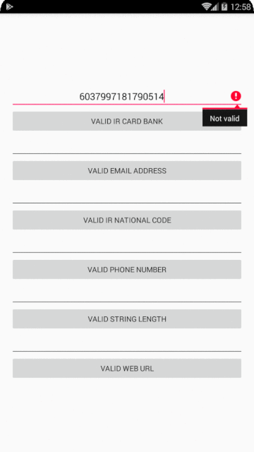

# PersianValidation
PersianValidation for Android,Applied and easy to operate

# ScreenShot

# Setup
The simplest way to use PersianValidation is to add the library as aar dependency to your build    

**Gradle**
1. Add the JitPack repository to your build file    
<pre>allprojects {
		repositories {
			...
			maven { url 'https://jitpack.io' }
		}
	}</pre>
2. Add the dependency  
<pre>dependencies {
	        implementation 'com.github.mahmoodkarimizade:PersianValidation:1.0.0'
	}</pre>
